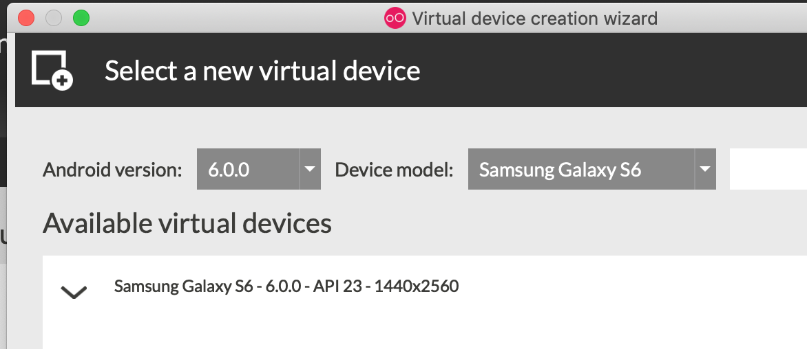

Back to [Main](README.md)

# How to Setup Genymotion #
Overview:

- [x] Install Genymotion
- [x] Setup Marshmallow emulator
- [x] Configure Google Play support
- [x] Setup Google Play
- [ ] Use ADB to Explore

## Step: Install Genymotion ##
First and foremost, navigate to the [Genymotion site] (https://www.genymotion.com) and grab the freeware version.

Run through the install instructions

## Step: Setup Marshmallow Emulator ##
Other versions of Android can be used in Genymotion.  However, I've found that Android 6.0 is the most straight forward to connect to GooglePlay due to availability of ARM Translation libraries.

Launch Geny motion and create a new emulator (+ button).

Set the filters to drill down to a Samsung S6 with 6.0.0.

Select the correct emulator and click 'Next'.  Provide a name and 'Next' again.

## Configure GooglePlay Support ##
The follow files will be used to complete this step.  You can alternatively grab different translation add-ons or Open GApps zips, but you're on your own for that.
- [ARM_Translation_Marshmallow.zip](../dist/emulator/add-ons/ARM_Translation_Marshmallow.zip)
- [gapps-x86-6.0_20160402.zip](../dist/emulator/add-ons/gapps-x86-6.0_20160402.zip)

Once the emulator is started, drag 'ARM_Translation_Marshmallow.zip' on top of it.  Click OK / Confirm through the prompts and wait for install to complete.

Drag 'Agapps-x86-6.0_20160402.zip' on top of it.  Click OK / Confirm through the prompts and wait for install to complete.

Click the close button on the emulator to shut down the VM.  Start the emulator again from the main Genymotion app.

Wait while emulator launches.  You will see it processing several steps related to Google Play.

## Setup Google Play ##

Open the Google Play app on the emulator.  Walk through the steps to:
- Accept T&C
- Provide a google account for store
- Setup payment methods at your own risk (not recommended)

Download an app from PlayStore and test that everything works.

Enjoy! :)
